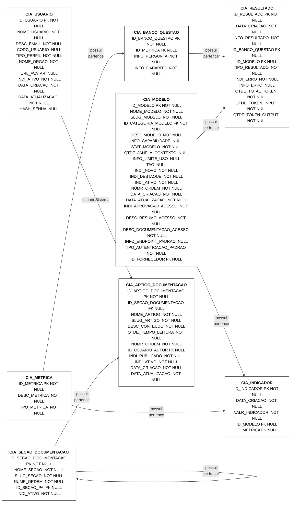

```mermaid
flowchart LR
  classDef table fill:#ffffff,stroke:#111,stroke-width:1px,color:#000;
  classDef pivot fill:#f7f7f7,stroke:#111,stroke-width:1px,color:#000;

  CIA_USUARIO["<b>CIA_USUARIO</b><br/>ID_USUARIO PK NOT NULL<br/>NOME_USUARIO  NOT NULL<br/>DESC_EMAIL  NOT NULL<br/>CODG_USUARIO  NULL<br/>TIPO_PERFIL  NOT NULL<br/>NOME_ORGAO  NOT NULL<br/>URL_AVATAR  NULL<br/>INDI_ATIVO  NOT NULL<br/>DATA_CRIACAO  NOT NULL<br/>DATA_ATUALIZACAO  NOT NULL<br/>HASH_SENHA  NULL"]
  class CIA_USUARIO table;

  CIA_MODELO["<b>CIA_MODELO</b><br/>ID_MODELO PK NOT NULL<br/>NOME_MODELO  NOT NULL<br/>SLUG_MODELO  NOT NULL<br/>ID_CATEGORIA_MODELO FK NOT NULL<br/>DESC_MODELO  NOT NULL<br/>INFO_CAPABILIDADE  NULL<br/>STAT_MODELO  NOT NULL<br/>QTDE_JANELA_CONTEXTO  NULL<br/>INFO_LIMITE_USO  NULL<br/>TAG  NULL<br/>INDI_NOVO  NOT NULL<br/>INDI_DESTAQUE  NOT NULL<br/>INDI_ATIVO  NOT NULL<br/>NUMR_ORDEM  NOT NULL<br/>DATA_CRIACAO  NOT NULL<br/>DATA_ATUALIZACAO  NOT NULL<br/>INDI_APROVACAO_ACESSO  NOT NULL<br/>DESC_RESUMO_ACESSO  NOT NULL<br/>DESC_DOCUMENTACAO_ACESSO  NOT NULL<br/>INFO_ENDPOINT_PADRAO  NULL<br/>TIPO_AUTENTICACAO_PADRAO  NOT NULL<br/>ID_FORNECEDOR FK NULL"]
  class CIA_MODELO table;

  CIA_METRICA["<b>CIA_METRICA</b><br/>ID_METRICA PK NOT NULL<br/>DESC_METRICA  NOT NULL<br/>TIPO_METRICA  NOT NULL"]
  class CIA_METRICA table;

  CIA_BANCO_QUESTAO["<b>CIA_BANCO_QUESTAO</b><br/>ID_BANCO_QUESTAO PK NOT NULL<br/>ID_METRICA FK NULL<br/>INFO_PERGUNTA  NOT NULL<br/>INFO_GABARITO  NOT NULL"]
  class CIA_BANCO_QUESTAO table;

  CIA_RESULTADO["<b>CIA_RESULTADO</b><br/>ID_RESULTADO PK NOT NULL<br/>DATA_CRIACAO  NOT NULL<br/>INFO_RESULTADO  NOT NULL<br/>ID_BANCO_QUESTAO FK NULL<br/>ID_MODELO FK NULL<br/>TIPO_RESULTADO  NOT NULL<br/>INDI_ERRO  NOT NULL<br/>INFO_ERRO  NULL<br/>QTDE_TOTAL_TOKEN  NOT NULL<br/>QTDE_TOKEN_INPUT  NOT NULL<br/>QTDE_TOKEN_OUTPUT  NOT NULL"]
  class CIA_RESULTADO table;

  CIA_INDICADOR["<b>CIA_INDICADOR</b><br/>ID_INDICADOR PK NOT NULL<br/>DATA_CRIACAO  NOT NULL<br/>VALR_INDICADOR  NOT NULL<br/>ID_MODELO FK NULL<br/>ID_METRICA FK NULL"]
  class CIA_INDICADOR table;

  CIA_ARTIGO_DOCUMENTACAO["<b>CIA_ARTIGO_DOCUMENTACAO</b><br/>ID_ARTIGO_DOCUMENTACAO PK NOT NULL<br/>ID_SECAO_DOCUMENTACAO FK NULL<br/>NOME_ARTIGO  NOT NULL<br/>SLUG_ARTIGO  NOT NULL<br/>DESC_CONTEUDO  NOT NULL<br/>QTDE_TEMPO_LEITURA  NOT NULL<br/>NUMR_ORDEM  NOT NULL<br/>ID_USUARIO_AUTOR FK NULL<br/>INDI_PUBLICADO  NOT NULL<br/>INDI_ATIVO  NOT NULL<br/>DATA_CRIACAO  NOT NULL<br/>DATA_ATUALIZACAO  NOT NULL"]
  class CIA_ARTIGO_DOCUMENTACAO table;

  CIA_SECAO_DOCUMENTACAO["<b>CIA_SECAO_DOCUMENTACAO</b><br/>ID_SECAO_DOCUMENTACAO PK NOT NULL<br/>NOME_SECAO  NOT NULL<br/>SLUG_SECAO  NOT NULL<br/>NUMR_ORDEM  NOT NULL<br/>ID_SECAO_PAI FK NULL<br/>INDI_ATIVO  NOT NULL"]
  class CIA_SECAO_DOCUMENTACAO table;

  CIA_USUARIO -->|"usuarioSistema"| CIA_ARTIGO_DOCUMENTACAO
  CIA_SECAO_DOCUMENTACAO -->|"possui<br/>pertence"| CIA_ARTIGO_DOCUMENTACAO
  CIA_SECAO_DOCUMENTACAO -->|"possui<br/>pertence"| CIA_SECAO_DOCUMENTACAO
  CIA_METRICA -->|"possui<br/>pertence"| CIA_BANCO_QUESTAO
  CIA_MODELO -->|"possui<br/>pertence"| CIA_INDICADOR
  CIA_METRICA -->|"possui<br/>pertence"| CIA_INDICADOR
  CIA_BANCO_QUESTAO -->|"possui<br/>pertence"| CIA_RESULTADO
  CIA_MODELO -->|"possui<br/>pertence"| CIA_RESULTADO
```
