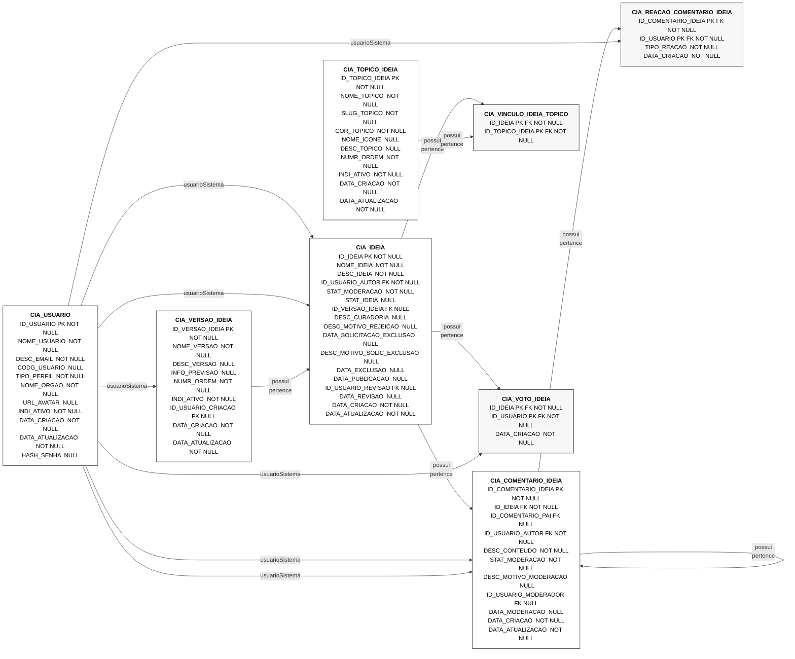

```mermaid
flowchart LR
  classDef table fill:#ffffff,stroke:#111,stroke-width:1px,color:#000;
  classDef pivot fill:#f7f7f7,stroke:#111,stroke-width:1px,color:#000;

  CIA_USUARIO["<b>CIA_USUARIO</b><br/>ID_USUARIO PK NOT NULL<br/>NOME_USUARIO  NOT NULL<br/>DESC_EMAIL  NOT NULL<br/>CODG_USUARIO  NULL<br/>TIPO_PERFIL  NOT NULL<br/>NOME_ORGAO  NOT NULL<br/>URL_AVATAR  NULL<br/>INDI_ATIVO  NOT NULL<br/>DATA_CRIACAO  NOT NULL<br/>DATA_ATUALIZACAO  NOT NULL<br/>HASH_SENHA  NULL"]
  class CIA_USUARIO table;

  CIA_REACAO_COMENTARIO_IDEIA["<b>CIA_REACAO_COMENTARIO_IDEIA</b><br/>ID_COMENTARIO_IDEIA PK FK NOT NULL<br/>ID_USUARIO PK FK NOT NULL<br/>TIPO_REACAO  NOT NULL<br/>DATA_CRIACAO  NOT NULL"]
  class CIA_REACAO_COMENTARIO_IDEIA pivot;

  CIA_COMENTARIO_IDEIA["<b>CIA_COMENTARIO_IDEIA</b><br/>ID_COMENTARIO_IDEIA PK NOT NULL<br/>ID_IDEIA FK NOT NULL<br/>ID_COMENTARIO_PAI FK NULL<br/>ID_USUARIO_AUTOR FK NOT NULL<br/>DESC_CONTEUDO  NOT NULL<br/>STAT_MODERACAO  NOT NULL<br/>DESC_MOTIVO_MODERACAO  NULL<br/>ID_USUARIO_MODERADOR FK NULL<br/>DATA_MODERACAO  NULL<br/>DATA_CRIACAO  NOT NULL<br/>DATA_ATUALIZACAO  NOT NULL"]
  class CIA_COMENTARIO_IDEIA table;

  CIA_VINCULO_IDEIA_TOPICO["<b>CIA_VINCULO_IDEIA_TOPICO</b><br/>ID_IDEIA PK FK NOT NULL<br/>ID_TOPICO_IDEIA PK FK NOT NULL"]
  class CIA_VINCULO_IDEIA_TOPICO pivot;

  CIA_TOPICO_IDEIA["<b>CIA_TOPICO_IDEIA</b><br/>ID_TOPICO_IDEIA PK NOT NULL<br/>NOME_TOPICO  NOT NULL<br/>SLUG_TOPICO  NOT NULL<br/>COR_TOPICO  NOT NULL<br/>NOME_ICONE  NULL<br/>DESC_TOPICO  NULL<br/>NUMR_ORDEM  NOT NULL<br/>INDI_ATIVO  NOT NULL<br/>DATA_CRIACAO  NOT NULL<br/>DATA_ATUALIZACAO  NOT NULL"]
  class CIA_TOPICO_IDEIA table;

  CIA_VERSAO_IDEIA["<b>CIA_VERSAO_IDEIA</b><br/>ID_VERSAO_IDEIA PK NOT NULL<br/>NOME_VERSAO  NOT NULL<br/>DESC_VERSAO  NULL<br/>INFO_PREVISAO  NULL<br/>NUMR_ORDEM  NOT NULL<br/>INDI_ATIVO  NOT NULL<br/>ID_USUARIO_CRIACAO FK NULL<br/>DATA_CRIACAO  NOT NULL<br/>DATA_ATUALIZACAO  NOT NULL"]
  class CIA_VERSAO_IDEIA table;

  CIA_VOTO_IDEIA["<b>CIA_VOTO_IDEIA</b><br/>ID_IDEIA PK FK NOT NULL<br/>ID_USUARIO PK FK NOT NULL<br/>DATA_CRIACAO  NOT NULL"]
  class CIA_VOTO_IDEIA pivot;

  CIA_IDEIA["<b>CIA_IDEIA</b><br/>ID_IDEIA PK NOT NULL<br/>NOME_IDEIA  NOT NULL<br/>DESC_IDEIA  NOT NULL<br/>ID_USUARIO_AUTOR FK NOT NULL<br/>STAT_MODERACAO  NOT NULL<br/>STAT_IDEIA  NULL<br/>ID_VERSAO_IDEIA FK NULL<br/>DESC_CURADORIA  NULL<br/>DESC_MOTIVO_REJEICAO  NULL<br/>DATA_SOLICITACAO_EXCLUSAO  NULL<br/>DESC_MOTIVO_SOLIC_EXCLUSAO  NULL<br/>DATA_EXCLUSAO  NULL<br/>DATA_PUBLICACAO  NULL<br/>ID_USUARIO_REVISAO FK NULL<br/>DATA_REVISAO  NULL<br/>DATA_CRIACAO  NOT NULL<br/>DATA_ATUALIZACAO  NOT NULL"]
  class CIA_IDEIA table;

  CIA_COMENTARIO_IDEIA -->|"possui<br/>pertence"| CIA_REACAO_COMENTARIO_IDEIA
  CIA_USUARIO -->|"usuarioSistema"| CIA_REACAO_COMENTARIO_IDEIA
  CIA_IDEIA -->|"possui<br/>pertence"| CIA_COMENTARIO_IDEIA
  CIA_USUARIO -->|"usuarioSistema"| CIA_COMENTARIO_IDEIA
  CIA_USUARIO -->|"usuarioSistema"| CIA_COMENTARIO_IDEIA
  CIA_COMENTARIO_IDEIA -->|"possui<br/>pertence"| CIA_COMENTARIO_IDEIA
  CIA_IDEIA -->|"possui<br/>pertence"| CIA_VINCULO_IDEIA_TOPICO
  CIA_TOPICO_IDEIA -->|"possui<br/>pertence"| CIA_VINCULO_IDEIA_TOPICO
  CIA_USUARIO -->|"usuarioSistema"| CIA_VERSAO_IDEIA
  CIA_IDEIA -->|"possui<br/>pertence"| CIA_VOTO_IDEIA
  CIA_USUARIO -->|"usuarioSistema"| CIA_VOTO_IDEIA
  CIA_USUARIO -->|"usuarioSistema"| CIA_IDEIA
  CIA_USUARIO -->|"usuarioSistema"| CIA_IDEIA
  CIA_VERSAO_IDEIA -->|"possui<br/>pertence"| CIA_IDEIA
```
