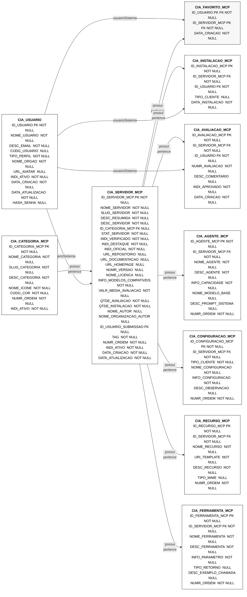

```mermaid
flowchart LR
  classDef table fill:#ffffff,stroke:#111,stroke-width:1px,color:#000;
  classDef pivot fill:#f7f7f7,stroke:#111,stroke-width:1px,color:#000;

  CIA_USUARIO["<b>CIA_USUARIO</b><br/>ID_USUARIO PK NOT NULL<br/>NOME_USUARIO  NOT NULL<br/>DESC_EMAIL  NOT NULL<br/>CODG_USUARIO  NULL<br/>TIPO_PERFIL  NOT NULL<br/>NOME_ORGAO  NOT NULL<br/>URL_AVATAR  NULL<br/>INDI_ATIVO  NOT NULL<br/>DATA_CRIACAO  NOT NULL<br/>DATA_ATUALIZACAO  NOT NULL<br/>HASH_SENHA  NULL"]
  class CIA_USUARIO table;

  CIA_AGENTE_MCP["<b>CIA_AGENTE_MCP</b><br/>ID_AGENTE_MCP PK NOT NULL<br/>ID_SERVIDOR_MCP FK NOT NULL<br/>NOME_AGENTE  NOT NULL<br/>DESC_AGENTE  NOT NULL<br/>INFO_CAPACIDADE  NOT NULL<br/>NOME_MODELO_BASE  NULL<br/>DESC_PROMPT_SISTEMA  NULL<br/>NUMR_ORDEM  NOT NULL"]
  class CIA_AGENTE_MCP table;

  CIA_CATEGORIA_MCP["<b>CIA_CATEGORIA_MCP</b><br/>ID_CATEGORIA_MCP PK NOT NULL<br/>NOME_CATEGORIA  NOT NULL<br/>SLUG_CATEGORIA  NOT NULL<br/>DESC_CATEGORIA  NOT NULL<br/>NOME_ICONE  NOT NULL<br/>CODG_COR  NOT NULL<br/>NUMR_ORDEM  NOT NULL<br/>INDI_ATIVO  NOT NULL"]
  class CIA_CATEGORIA_MCP table;

  CIA_CONFIGURACAO_MCP["<b>CIA_CONFIGURACAO_MCP</b><br/>ID_CONFIGURACAO_MCP PK NOT NULL<br/>ID_SERVIDOR_MCP FK NOT NULL<br/>TIPO_CLIENTE  NOT NULL<br/>NOME_CONFIGURACAO  NOT NULL<br/>INFO_CONFIGURACAO  NOT NULL<br/>DESC_OBSERVACAO  NULL<br/>NUMR_ORDEM  NOT NULL"]
  class CIA_CONFIGURACAO_MCP table;

  CIA_FAVORITO_MCP["<b>CIA_FAVORITO_MCP</b><br/>ID_USUARIO PK FK NOT NULL<br/>ID_SERVIDOR_MCP PK FK NOT NULL<br/>DATA_CRIACAO  NOT NULL"]
  class CIA_FAVORITO_MCP pivot;

  CIA_INSTALACAO_MCP["<b>CIA_INSTALACAO_MCP</b><br/>ID_INSTALACAO_MCP PK NOT NULL<br/>ID_SERVIDOR_MCP FK NOT NULL<br/>ID_USUARIO FK NOT NULL<br/>TIPO_CLIENTE  NULL<br/>DATA_INSTALACAO  NOT NULL"]
  class CIA_INSTALACAO_MCP table;

  CIA_RECURSO_MCP["<b>CIA_RECURSO_MCP</b><br/>ID_RECURSO_MCP PK NOT NULL<br/>ID_SERVIDOR_MCP FK NOT NULL<br/>NOME_RECURSO  NOT NULL<br/>URI_TEMPLATE  NOT NULL<br/>DESC_RECURSO  NOT NULL<br/>TIPO_MIME  NULL<br/>NUMR_ORDEM  NOT NULL"]
  class CIA_RECURSO_MCP table;

  CIA_AVALIACAO_MCP["<b>CIA_AVALIACAO_MCP</b><br/>ID_AVALIACAO_MCP PK NOT NULL<br/>ID_SERVIDOR_MCP FK NOT NULL<br/>ID_USUARIO FK NOT NULL<br/>NUMR_AVALIACAO  NOT NULL<br/>DESC_COMENTARIO  NULL<br/>INDI_APROVADO  NOT NULL<br/>DATA_CRIACAO  NOT NULL"]
  class CIA_AVALIACAO_MCP table;

  CIA_SERVIDOR_MCP["<b>CIA_SERVIDOR_MCP</b><br/>ID_SERVIDOR_MCP PK NOT NULL<br/>NOME_SERVIDOR  NOT NULL<br/>SLUG_SERVIDOR  NOT NULL<br/>DESC_RESUMIDA  NOT NULL<br/>DESC_SERVIDOR  NOT NULL<br/>ID_CATEGORIA_MCP FK NULL<br/>STAT_SERVIDOR  NOT NULL<br/>INDI_VERIFICADO  NOT NULL<br/>INDI_DESTAQUE  NOT NULL<br/>INDI_OFICIAL  NOT NULL<br/>URL_REPOSITORIO  NULL<br/>URL_DOCUMENTACAO  NULL<br/>URL_HOMEPAGE  NULL<br/>NUMR_VERSAO  NULL<br/>NOME_LICENCA  NULL<br/>INFO_MODELOS_COMPATIVEIS  NOT NULL<br/>VALR_MEDIA_AVALIACAO  NOT NULL<br/>QTDE_AVALIACAO  NOT NULL<br/>QTDE_INSTALACAO  NOT NULL<br/>NOME_AUTOR  NULL<br/>NOME_ORGANIZACAO_AUTOR  NULL<br/>ID_USUARIO_SUBMISSAO FK NULL<br/>TAG  NOT NULL<br/>NUMR_ORDEM  NOT NULL<br/>INDI_ATIVO  NOT NULL<br/>DATA_CRIACAO  NOT NULL<br/>DATA_ATUALIZACAO  NOT NULL"]
  class CIA_SERVIDOR_MCP table;

  CIA_FERRAMENTA_MCP["<b>CIA_FERRAMENTA_MCP</b><br/>ID_FERRAMENTA_MCP PK NOT NULL<br/>ID_SERVIDOR_MCP FK NOT NULL<br/>NOME_FERRAMENTA  NOT NULL<br/>DESC_FERRAMENTA  NOT NULL<br/>INFO_PARAMETRO  NOT NULL<br/>TIPO_RETORNO  NULL<br/>DESC_EXEMPLO_CHAMADA  NULL<br/>NUMR_ORDEM  NOT NULL"]
  class CIA_FERRAMENTA_MCP table;

  CIA_SERVIDOR_MCP -->|"possui<br/>pertence"| CIA_AGENTE_MCP
  CIA_SERVIDOR_MCP -->|"possui<br/>pertence"| CIA_CONFIGURACAO_MCP
  CIA_USUARIO -->|"usuarioSistema"| CIA_FAVORITO_MCP
  CIA_SERVIDOR_MCP -->|"possui<br/>pertence"| CIA_FAVORITO_MCP
  CIA_SERVIDOR_MCP -->|"possui<br/>pertence"| CIA_INSTALACAO_MCP
  CIA_USUARIO -->|"usuarioSistema"| CIA_INSTALACAO_MCP
  CIA_SERVIDOR_MCP -->|"possui<br/>pertence"| CIA_RECURSO_MCP
  CIA_SERVIDOR_MCP -->|"possui<br/>pertence"| CIA_AVALIACAO_MCP
  CIA_USUARIO -->|"usuarioSistema"| CIA_AVALIACAO_MCP
  CIA_CATEGORIA_MCP -->|"possui<br/>pertence"| CIA_SERVIDOR_MCP
  CIA_USUARIO -->|"usuarioSistema"| CIA_SERVIDOR_MCP
  CIA_SERVIDOR_MCP -->|"possui<br/>pertence"| CIA_FERRAMENTA_MCP
```
